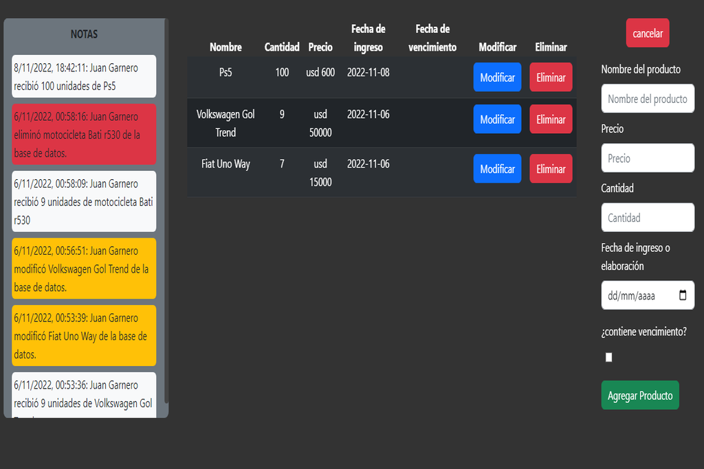

# Stock Control System with React and Firebase

This project is a stock control system that uses React for the frontend and Firebase for the backend. With it, you can keep a record of your products and their available quantities easily and quickly.

## Installation

To install this project, you must first have Node.js and npm installed on your computer. Then, clone this repository and run the following command in your terminal:

> npm install

This will install all the necessary dependencies for the project to work.

## Usage

To use the system, run the following command in your terminal:

> npm start

This will start the development server in local mode. Open your browser at the address `http://localhost:3000` to start using the system.

## Features

- Superuser: This system has a superuser who has full control of the application and can manage the other roles.

- Roles: The system has three different roles: buyer, seller, and deposit. Each one is responsible for a specific part of stock control.

- Product registration: All the products you add to the system will be saved in Firebase, where you can access them at any time to verify their available quantity.

- Stock control: The system will allow you to verify the available quantity of your products at all times, which will help you make informed decisions about when it is necessary to reorder.

## Test Emails

Here are some test accounts you can use to access the system and test its features:

- Admin:

  - Email: superuser@superuser.com
  - Password: 1234567890

- Storage Area:

  - Email: deposito@rol.com
  - Password: 1234567890

- Sales Area:
  - Email: vendedor@rol.com
  - Password: 1234567890

## Contribution

This project has been created by Lucas Butto (GitHub: https://github.com/LucasButto), Juan Ignacio Garnero (GitHub: https://github.com/juaanig), and Francisco Mulé (GitHub: https://github.com/franmux01).

This is an open-source project and we are excited to receive contributions from the community. If you want to contribute, please make a fork of this repository and create a pull request with your changes.

## Screenshot

    

